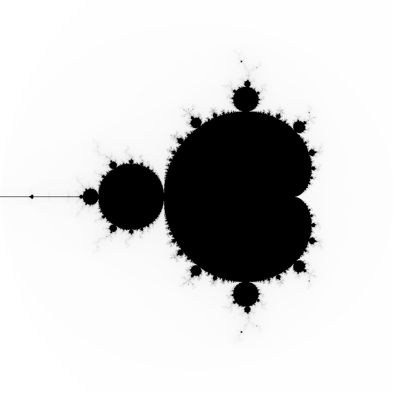
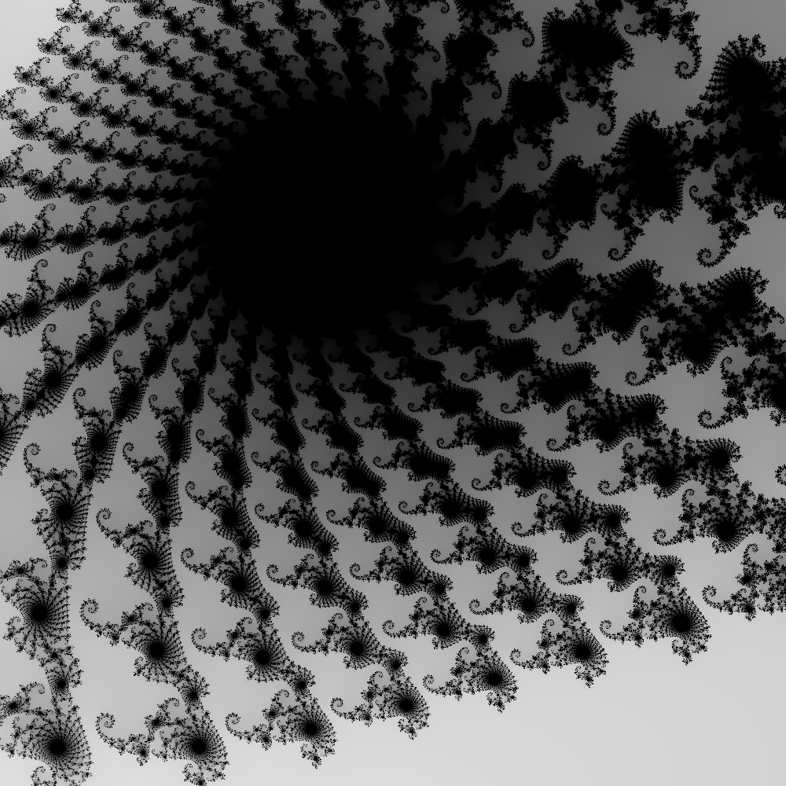

# Multi-threaded Mandelbrot Set Renderer

A parallel implementation of the Mandelbrot Set renderer in C using POSIX threads, demonstrating producer-consumer patterns with mutexes, semaphores, and barriers.

## Overview

This program renders the Mandelbrot Set to BMP images using multiple threads for parallel computation. Column threads (producers) generate coordinates in the complex plane, while engine threads (consumers) calculate pixel values using the escape-time algorithm.

## Requirements

- **Linux** or **WSL (Windows Subsystem for Linux)**
- GCC compiler with pthread support
- POSIX-compliant system

## Compilation

```bash
gcc -o mandelbrot mandelbrot.c -lpthread -lm
```

## Usage

```bash
./mandelbrot <img_dim> <engines> <UL_X> <UL_Y> <mandel_dim>
```

**Parameters:**
- `img_dim` - Image dimensions in pixels (creates square image)
- `engines` - Number of computational engine threads
- `UL_X`, `UL_Y` - Upper-left corner coordinates in complex plane
- `mandel_dim` - Width/height of image in complex plane

## Examples

**Classic Mandelbrot view (example1.bmp):**
```bash
./mandelbrot 800 4 -2.0 -1.5 3.0
```


**Detailed zoom (example2.bmp):**
```bash
./mandelbrot 1000 200 -0.747 -0.1252 0.003
```


## Technical Details

### Architecture
- **Column Threads**: One per image column, calculate complex plane coordinates
- **Engine Threads**: Configurable workers that compute Mandelbrot iterations (max 255)
- **Writer Thread**: Coordinates row completion using barriers

### Synchronization
- **Mutexes**: Protect shared engine data structures
- **Condition Variables**: Signal work availability (no busy-waiting)
- **Semaphore**: Serializes row data array writes
- **Barriers**: Synchronize threads between rows

## Output

Creates `mandeloutput.bmp` in the current directory.

## Project Structure

```
mandelbrot-renderer/
├── mandelbrot.c          # Source code
├── README.md             # This file
└── examples/             # Sample outputs
    ├── example1.bmp
    └── example2.bmp
```

## Notes

- Platform-specific: requires POSIX APIs (pthread, semaphore)
- Memory usage scales with image size and engine count
- Output is grayscale BMP format
- Performance improves with more engines up to CPU core count
